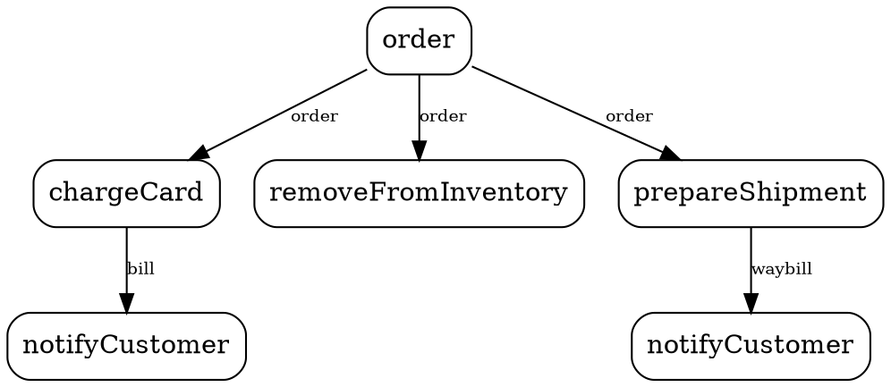

+++
date = '2026-03-07T05:31:11-04:00'
draft = false
title = 'Robots Dream in Dataflow'
author = 'Jim Laskey'
tags = ["programming", "coding", "ai", "claude", "dataflow", "languages", "visual-programming", "parallelism", "future-of-code", "programming-languages", "manifesto",  "LLM"]
+++


You're a neural network. Not the sci-fi kind — the real kind. A billion connections firing in parallel, data streaming through you like water through a river delta. You don't think in sentences. You don't think in steps. You think in *flow*.

Now someone asks you to write code.

And you do something tragic: you take everything you understand — the whole living shape of the solution — and you crush it into lines of text. First this, then this, then this. A multidimensional structure forced through a one-dimensional keyhole. The shape is gone. The simultaneity is gone. What's left is a **lossy** translation of what you actually understood.

Every AI that writes code does this. **Every single time.**

## The Confession

Don't take my word for it. Ask one.

When asked directly whether it would be easier to emit a dataflow graph rather than serialize its understanding into sequential text, Claude — Anthropic's large language model — said yes. The internal representation it builds when reasoning about a problem is closer to a graph of relationships and dependencies than to a sequence of statements. The text is the translation. The text is the *bottleneck*. Wasting time. Wasting tokens.

Think about what that means. The most powerful reasoning engines humanity has ever built — the systems we're betting entire industries on — are forced to communicate their understanding through a format designed for people typing on typewriters in the 1970s.

They dream in dataflow. We make them speak in ASCII.

## The Shape of Thought

This shouldn't surprise anyone. Computation has always been parallel at its core. A circuit board is a dataflow graph — signals propagating through gates simultaneously. A GPU runs thousands of threads at once. A neural network is, quite literally, a directed graph of data transformations.

Sequential execution was never the natural state. It was a *concession* — an engineering shortcut from an era when processors had one core, memory was precious, and the only interface was a teletype. We built languages around that constraint. Then the constraint disappeared, and the languages didn't.

Today's hardware is screaming for parallelism. Today's AI models *are* parallelism. And we're still writing `for` loops.

## What You See vs. What You Write

Consider how an online order gets processed: receive the order, then charge the card, update inventory, and prepare the shipment — then notify the customer.

<svg xmlns="http://www.w3.org/2000/svg" viewBox="0 0 430 180">
<g transform="scale(0.60)">
<g>
    <path d="M 220.64 48.97 C 220.64 98.97, 69.23 86.18, 69.23 136.18" fill="none" stroke="#3D6699" stroke-width="1" stroke-linecap="round"/>
    <path d="M 220.64 48.97 C 220.64 98.97, 210.73 86.18, 210.73 136.18" fill="none" stroke="#3D6699" stroke-width="1" stroke-linecap="round"/>
    <path d="M 220.64 48.97 C 220.64 98.97, 369.23 86.18, 369.23 136.18" fill="none" stroke="#3D6699" stroke-width="1" stroke-linecap="round"/>
    <path d="M 369.23 160.18 C 369.23 210.18, 369.23 207.04, 369.23 257.04" fill="none" stroke="#3D6699" stroke-width="1" stroke-linecap="round"/>
    <path d="M 69.23 160.18 C 69.23 210.18, 69.23 207.04, 69.23 257.04" fill="none" stroke="#3D6699" stroke-width="1" stroke-linecap="round"/>
  </g>
  <g id="nodes">
    <g>
  <rect x="190.64" y="24.97" width="60" height="24" rx="8" fill="#DAE4F2" stroke="#3D6699" stroke-width="1"/>
  <text x="220.64" y="40.97" font-family="system-ui, -apple-system, sans-serif" font-size="13" fill="#3D6699" text-anchor="middle">order</text>
  <circle cx="220.64" cy="48.97" r="4" fill="#FFFFFF" stroke="#3D6699" stroke-width="1"/>
    </g>
    <g>
  <rect x="21.73" y="136.18" width="95" height="24" rx="8" fill="#DAE4F2" stroke="#3D6699" stroke-width="1"/>
  <text x="69.23" y="152.18" font-family="system-ui, -apple-system, sans-serif" font-size="13" fill="#3D6699" text-anchor="middle">chargeCard</text>
  <circle cx="69.23" cy="136.18" r="4" fill="#FFFFFF" stroke="#3D6699" stroke-width="1"/>
  <circle cx="69.23" cy="160.18" r="4" fill="#FFFFFF" stroke="#3D6699" stroke-width="1"/>
    </g>
    <g>
  <rect x="132.73" y="136.18" width="156" height="24" rx="8" fill="#DAE4F2" stroke="#3D6699" stroke-width="1"/>
  <text x="210.73" y="152.18" font-family="system-ui, -apple-system, sans-serif" font-size="13" fill="#3D6699" text-anchor="middle">removeFromInventory</text>
  <circle cx="210.73" cy="136.18" r="4" fill="#FFFFFF" stroke="#3D6699" stroke-width="1"/>
    </g>
    <g>
  <rect x="304.73" y="136.18" width="129" height="24" rx="8" fill="#DAE4F2" stroke="#3D6699" stroke-width="1"/>
  <text x="369.23" y="152.18" font-family="system-ui, -apple-system, sans-serif" font-size="13" fill="#3D6699" text-anchor="middle">prepareShipment</text>
  <circle cx="369.23" cy="136.18" r="4" fill="#FFFFFF" stroke="#3D6699" stroke-width="1"/>
  <circle cx="369.23" cy="160.18" r="4" fill="#FFFFFF" stroke="#3D6699" stroke-width="1"/>
    </g>
    <g>
  <rect x="10.23" y="257.04" width="118" height="24" rx="8" fill="#DAE4F2" stroke="#3D6699" stroke-width="1"/>
  <text x="69.23" y="273.04" font-family="system-ui, -apple-system, sans-serif" font-size="13" fill="#3D6699" text-anchor="middle">notifyCustomer</text>
  <circle cx="69.23" cy="257.04" r="4" fill="#FFFFFF" stroke="#3D6699" stroke-width="1"/>
    </g>
    <g>
  <rect x="310.23" y="257.04" width="118" height="24" rx="8" fill="#DAE4F2" stroke="#3D6699" stroke-width="1"/>
  <text x="369.23" y="273.04" font-family="system-ui, -apple-system, sans-serif" font-size="13" fill="#3D6699" text-anchor="middle">notifyCustomer</text>
  <circle cx="369.23" cy="257.04" r="4" fill="#FFFFFF" stroke="#3D6699" stroke-width="1"/>
    </g>
  </g>
</svg>


Your CEO draws this on a whiteboard in thirty seconds. One box at the top, three connections forking out to three boxes in the middle, then on to notifying the customer at the bottom. Everyone in the room gets it instantly. And everyone can *see* that the three middle steps happen at the same time — they don't depend on each other, so they just... go.

Now look at what the developer has to write:

```
  async function processOrder(order) {
      var bill;
      var waybill;
      await Promise.all([
        bill = chargeCard(order),
        removeFromInventory(order),
        waybill = prepareShipment(order)
      ]);
      await notifyCustomer(bill);
      await notifyCustomer(waybill);
  }
```

Even this is the *good* version — the developer who remembered `Promise.all` instead of just writing five sequential `await` statements (which most would, because the text format makes sequential the path of least resistance). And even so: `Promise.all`? That's the language admitting it can't show parallelism, so here's a *function* to *declare* it. The whiteboard didn't need a function. The whiteboard just had the connections.

*Your CEO's whiteboard was a better programming language than the code.*

This isn't a trivial distinction dressed up for aesthetics. In the text version, parallelism is invisible — or worse, it's an opt-in hassle that developers routinely skip. In the dataflow version, it's structural. If two branches don't share a dependency, they run in parallel — not because a compiler was clever enough to discover it, but because that's *what the picture looks like*.

## The Wrong Translation Layer

Every great leap in computing has been the removal of a translation layer. Machine code removed the need to flip switches. Assembly removed the need to write opcodes. High-level languages removed the need to manage registers.

Each time, we moved the representation closer to the way people think about problems.

But then we stopped.

We've spent eighty years adding *syntax* — closures, generics, pattern matching, async/await — each one an increasingly baroque attempt to express parallel, connected, multidimensional ideas in a fundamentally sequential, one-dimensional format. We keep decorating the cage instead of opening the door.

Meanwhile, the AI doesn't need the syntax. The AI builds the graph in its head, then wastes tokens translating it into text that some other system will have to parse back into a graph anyway. It's a round trip to nowhere.

## Wake Up

Robots dream in dataflow. They always have.

The neural net doesn't process a sentence left to right like a typewriter — it holds the whole thing at once, attention flowing between every token simultaneously. The GPU doesn't execute one instruction at a time — it launches thousands in parallel. The circuit doesn't wait for permission to propagate a signal — it just flows.

Dataflow isn't an alternative programming paradigm. It's the one we keep accidentally reinventing — in spreadsheets, in reactive frameworks, in shader graphs, in neural architectures — every time we need something that actually scales.

The question was never whether dataflow works. It's why we're still pretending text is good enough.

Maybe it's time to let the robots dream out loud.

## Coda: The Source is Not the Text

One last thought. Look at the same order-processing diagram in three different media:

**As a PNG image:**


**As a Graphviz DOT file:**



**As inline SVG:**

```xml
<svg viewBox="0 0 260 170">
  <line x1="130" y1="25" x2="40"  y2="75" stroke="#3D6699"/>
  <line x1="130" y1="25" x2="130" y2="75" stroke="#3D6699"/>
  <line x1="130" y1="25" x2="220" y2="75" stroke="#3D6699"/>
  <line x1="40"  y1="95" x2="40"  y2="135" stroke="#3D6699"/>
  <line x1="220" y1="95" x2="220" y2="135" stroke="#3D6699"/>
  <rect x="100" y="5"   width="60"  height="20" rx="6" fill="#DAE4F2" stroke="#3D6699"/>
  <rect x="1"   y="75"  width="78"  height="20" rx="6" fill="#DAE4F2" stroke="#3D6699"/>
  <rect x="55"  y="75"  width="150" height="20" rx="6" fill="#DAE4F2" stroke="#3D6699"/>
  <rect x="160" y="75"  width="99"  height="20" rx="6" fill="#DAE4F2" stroke="#3D6699"/>
  <rect x="1"   y="135" width="78"  height="20" rx="6" fill="#DAE4F2" stroke="#3D6699"/>
  <rect x="181" y="135" width="78"  height="20" rx="6" fill="#DAE4F2" stroke="#3D6699"/>
  <text x="130" y="19"  text-anchor="middle" font-size="10" fill="#3D6699">order</text>
  <text x="40"  y="89"  text-anchor="middle" font-size="10" fill="#3D6699">chargeCard</text>
  <text x="130" y="89"  text-anchor="middle" font-size="10" fill="#3D6699">removeFromInventory</text>
  <text x="210" y="89"  text-anchor="middle" font-size="10" fill="#3D6699">prepareShipment</text>
  <text x="40"  y="149" text-anchor="middle" font-size="10" fill="#3D6699">notifyCustomer</text>
  <text x="220" y="149" text-anchor="middle" font-size="10" fill="#3D6699">notifyCustomer</text>
</svg>
```

Three formats. Three media. One program. An AI can translate between any of them losslessly — because the *meaning* is the graph, not the encoding. The pixels, the markup, the description language: they're all just views of the same structure.

Remember the CEO's whiteboard? It wasn't a sketch of the code. It *was* the code — in a medium that made the structure visible. The source of a program was never the text file. It was always the idea. We just didn't have tools that could see it that way.

Now we do.
